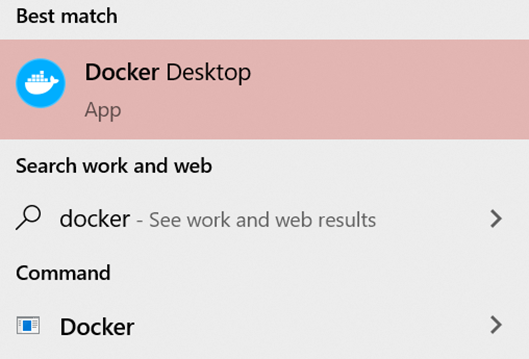

# IS 601 - Final Web Application

## Project Description

This website is designed for NJIT's course IS-601. We needed to research and develop one unique feature per team member
and integrate it into our application (Pycharm, Docker, Flask, MySQL).

## Team Members and Features

* Justin Nietzer - Created a login and registration process with email verification - [Step-by-Step](screenshots/Final%20Web%20App%20-%20JNietzer.pdf)

* Nikolett Muller - Created a statistics project to create API endpoints and then consume those endpoints using
  a JavaScript chart - [Step-by-Step](screenshots/Chart_Muller.pdf)

## Installation Instructions for Using the App with Docker

### 1. Installing Docker

#### For Windows Users

**Requirements**

* Windows 10, version 1903 or higher
* WSL 2 feature enabled
* Prerequisites for running WSL 2 on Windows 10
* 64 bit processor
* 4GB system RAM
* BIOS-level hardware virtualization support must be enabled in the BIOS settings
* Linux kernel update package is installed

1. Download Docker Desktop Installer.exe from Docker
2. Double-click on the file to run the installer. Ensure the Enable WSL 2 Features option is selected on the
   Configuration page. 
3. Docker Desktop does not run automatically after we installed it. To start the program, we need to
   search for it on our computer.

Docker is running when the whale icon appears on the taskbar.

#### For Mac users

**Requirements**

* macOS must be version 10.14 or newer (Mojave, Catalina, or Big Sur)
* At least 4 GB of RAM.

1. Double-click on Docker.dmg, then drag the Docker icon to our Applications folder.

2. Double-click on Docker.app in the Applications folder to start the program the first
time.

Docker is running when the whale icon appears on the taskbar.

### 2. How to Run the Final Web Application

1. While Docker is running, add a Configuration in Pycharm. Choose Docker then Docker-compose. After
choosing, give the path to docker-compose.yml and check both checkboxes under Options.
   

2. To view the mySQL Database in Pycharm, go to View / Tool Windows / Database. Click on the + sign, then
Data Source, then on MYSQL. We give our database a name: "homesData". The port is set to 32000. We give "root"
as user and password. Click on Test Connection to check the connection to the database. If everything works, click Apply and OK.

3. Add an interpreter. We choose Docker Compose, give the path to docker-compose.yml and
select app as a service. Finally, we click on OK. Choose the newly added interpreter.

4. For the Sendgrid API, you must install the .env file attached to the submission.

4. Run the app. In order to see the website, we type "http://localhost:5000" into the address bar of our
internet browser.
